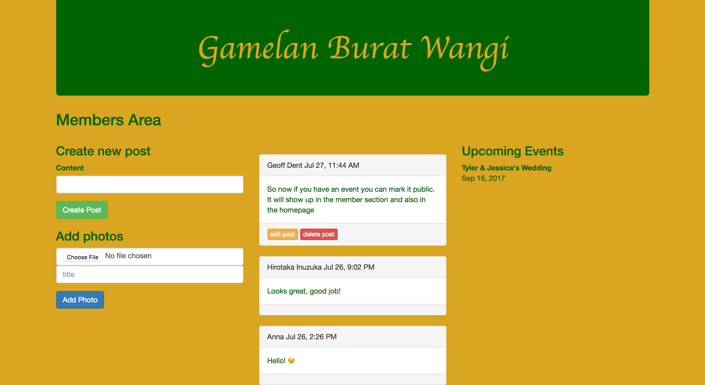

# Gamelan Burat Wangi

**Gamelan Burat Wangi** is one of the groups I play with. This web app is designed for the group to communicate with each other easily via posting and event listing. It is a fully CRUDDY app. Posts can be created and read by members of the group and edited and deleted by the creator. Events are also fully editable.  One feature of the events function is private group events remain private, but public events like concerts and workshops will appear in both the member section and the front facing web page. Members, once created, can be edited by the user, but can only be deleted by the administrator(me). Users are able to upload pictures as well.

### Technologies used

* Ruby 
* Rails 5.1
* HTML
* CSS
* Bootstrap
* Postgresql

### Getting started
Gamelan Burat Wangi is deployed using Heroku at the following url

[Gamelan Burat Wangi](https://gamelanburatwangi.herokuapp.com/)

See my planning page at
[Trello](https://trello.com/b/xkpBeYN6/project-2-burat-wangi-web-application)

### Next steps
At present, picture uploading is possible, but not pretty. Users have the ability to upload a profile picture, but at the time of this document, they are not visible. In the future I would like to add a more cohesive events-photo page, audio and video uploads. I would also like to generalize the app to be a social media and discovery tool for anybody interested in Indonesian music.
